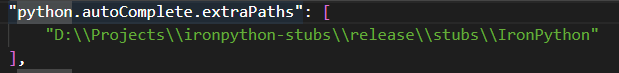
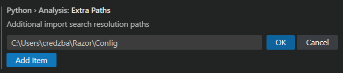
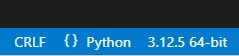
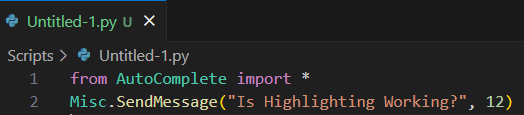
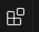
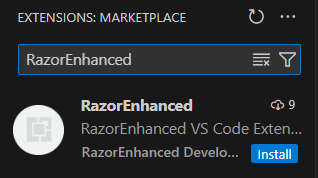
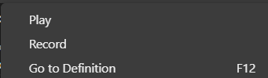
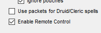
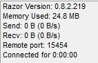
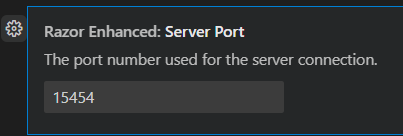

1. # Using VS Code as RazorEnhanced Editor

### Install 

> (some stolen from **HeelYes#0441** excellent tutorial at: [VSCode Auto Completion](https://razorenhanced.github.io/doc/tutorials/VSCode_AutoComplete/VSCode_AutoComplete_Setup.html) )

## 1. Install Visual Studio Code (VSC).

- Download the software here: [Microsoft Download](https://code.visualstudio.com/Download)
- Took defaults on Select Additional Task
- Install. (ex: Install path C:/program files/VSCode/ )
- Launch VSC

## 3. Install the Python Package for VSC

- Download the add-on: [Python on Microsoft Marketplace](https://marketplace.visualstudio.com/items?itemName=ms-python.python)
- This includes Python Language, Pylance and Jupyter

## 4. Add IronPython Typings

- Download (or clone) the repo from @Gui_Talarico [github](https://github.com/gtalarico/ironpython-stubs)

- For this example I cloned the repo to my Projects directory (D:\Projects):

  - git clone https://github.com/gtalarico/ironpython-stubs.git or download zip from https://github.com/gtalarico/ironpython-stubs/archive/refs/heads/master.zip

  - **note**: for me resulting directory of interest is D:\\Projects\\ironpython-stubs\\release\\stubs\\IronPython

    

## 5. Change VSC settings

- In VSC file > Preferences > Settings or the cob wheel in low left corner choose Settings

- Under the Settings tab, enter “python.autoComplete.extraPaths” into the Search Settings box (no quotes).

  - Click on the “Edit in settings.json” link/button.
  - Add the following into the line provided: “D:\\\Projects\\\ironpython-stubs\\\release\\\stubs\\\IronPython” (your path may be different depending on where you cloned the repo in #4) also (note windows needs the double \\ )
  - Use the full path for your environment
  - e.g. 
    
  - Hit CTRL-S to save the changes.
  - Close the “settings.json” editor.

- Click on the “Clear Setting Search Input” icon that is on the far right of the Search Box.

- Under the Settings tab, enter “python.analysis.extraPaths” into the Search Settings box (no quotes).

  - In the String Item area, add the following: C:\Users\credzba\Razor\Config

  - Use the full path for your environment, no quotes, no double \

  - e.g.

    

  - Click the OK button.

- Hit CTRL+S to save the changes, then ALT+F4 to exit VSC, then restart VSC.

## Test Working

- Open a new python document (ensure lower right hand says python)

  

- Add the import and a RE command

  `from AutoComplete import * `

  Misc.SendMessage("Is Highlighting Working?", 12)

  

## Make VSC the Default Editor for RazorEnhanced

- Define an environment variable named **EDITOR** that is the full path to the vscode executable.

## Install RazorEnhanced extension

- open the extensions bar. ctrl-shift-x or this icon on left side.

  

- In search box type RazorEnhanced

- click install

- back to your test python document, right click for context menu

- In the RE control window enable remote control on the options tab:
  

- Normally you should not have to change any setting, the VSC extension uses port 15454 to communicate with the game.  You can verify the port in use on the help tab of the RazorEnhanced control window

  

- If you run multiple copies of RazorEnhanced concurrently, this port will increment for each copy. You will need to change the setting in VSC if you want to talk to some other remoter port

  - In VSC file > Preferences > Settings or the cob wheel in low left corner choose Settings

  - Under the Settings tab, enter "RazorEnhanced"” into the Search Settings box (no quotes).

    

    change the port number to talk to the desired copy of RazorEnhanced.

  